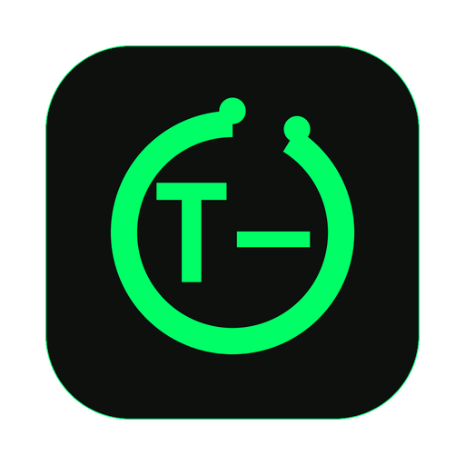

# FloatClock

**A borderless, transparent, always-on-top countdown overlay.** The window contains nothing but bold green monospace text: it drags, it locks, and both of its moments fire a system notification as they approach.

[](https://github.com/bananaxiao2333/float-clock/actions/workflows/ci.yml)
[](https://github.com/bananaxiao2333/float-clock/actions/workflows/release.yml)
[](https://github.com/bananaxiao2333/float-clock/releases/latest)
[](https://github.com/bananaxiao2333/float-clock/releases)
[](LICENSE)
[](CHANGELOG.md)

[](https://www.rust-lang.org/)
[](#platform-differences)
[](#quick-start)
[](https://github.com/bananaxiao2333/float-clock/actions/workflows/ci.yml)
[](#platform-differences)
[](#the-tray-icon)

Written in Rust: one codebase cross-compiles to single-file executables for **macOS, Linux and Windows**. Double-click and it runs, with no Python and no runtime to install.

The [Python version](https://github.com/bananaxiao2333/float-clock/tree/python) (the original uv + Tk implementation) lives on the `python` branch.

```text
T-02:29:00            main title: time left until the offset moment
  T-00:29:00          subtitle: time elapsed since the target time
20:29:00 | +02:00:00  third line: target time and offset
```

---

## Two situations this exists for

It is a clock that will not let you look away, so it earns its keep where the
number matters more than the app around it.

### Your base has been found, and the strike lands in 30 minutes

The detection is the thing that already happened; the impact is the thing you
are racing. That is exactly the shape the two moments have: target the
detection, offset the warning you got.

```toml
[time]
target = "2026-09-20T21:15:00"   # the moment the strike was detected
offset = "+30m"                   # 30 minutes to impact

[notify]
before = [600, 300, 180, 120, 60, 30, 10, 5, 3, 2, 1]
after  = []
at_moment = true
```

```text
T-00:27:41            main title: time left until impact (21:45:00)
  T+00:02:19          subtitle: time since detection, counting up
21:15:00 | +00:30:00  third line: both moments at once
```

The main title is the only thing you need to read, and it never leaves the
screen: it drops through `T-00:10:00`, `T-01:00`, `T-00:10` and each of those is
a system notification too, so the last minute reaches you even if the overlay is
behind something. Nothing has to be configured first either:

```bash
float-clock --target 2026-09-20T21:15:00 --offset +30m
```

Write the full date there. A bare `21:15` means *today*, and if that time has
already passed it rolls over to tomorrow - which is what you want for the daily
schedule below, and a 24-hour countdown when you are in the middle of an alert.

### Ticket sales open at 20:00 and the queue is the whole game

You do not want a countdown to 20:00; you want one to 19:55, when you should
already be sitting on the page with your card details pasted. A negative offset
buys you that lead time.

```toml
[time]
target = "20:00"      # on sale now, and the same time every day after that
offset = "-00:05:00"  # start refreshing five minutes early
```

```text
T-00:05:00            main title: time left until you should be trying
  T-00:10:00          subtitle: time left until the actual on-sale time
20:00:00 | -00:05:00  third line: the on-sale time, and the lead you asked for
```

The big number is the actionable one: it hits `T-00:00:00` and flips to `T+…` at
19:55, which is the signal to start clicking, while the subtitle keeps counting
down to the sale itself. A bare `20:00` means today, and rolls over to tomorrow
once it has passed, so the same config works the next day without being touched.

---

## Quick start

### 1. Download

Every platform publishes one `.zip` and nothing else. Grab it from [**Releases**](https://github.com/bananaxiao2333/float-clock/releases/latest):

| Platform | Download this | How to run it |
| --- | --- | --- |
| **macOS** | `float-clock-macos-universal.zip` | unpack, then double-click `FloatClock.app` (universal arm64 + x86_64) |
| **Linux** | `float-clock-linux-x86_64.zip` | unpack, then `chmod +x float-clock && ./float-clock` |
| **Windows** | `float-clock-windows-x86_64.zip` | unpack, then double-click `float-clock.exe` |

Each archive contains the program and nothing else - no wrapper folder, no read-me, no example config. Unpack it and what you downloaded is right there.

Bare binaries are **not** published any more. A browser download strips the executable bit, and Finder then treats a bare Mach-O binary as a text file: it hands it to TextEdit, which reports *"the text encoding Unicode (UTF-8) is not applicable"*. A zip records the file mode, so unpacking restores it. Shipping one archive format for every platform also removes the "which file do I download?" question.

Unpack the archive before running anything; do not launch the executable straight out of an archive viewer.

Platform notes:

* **macOS** - the app is ad-hoc signed but not notarized. On first launch, right-click the app and choose **Open** once, or clear the quarantine flag: `xattr -dr com.apple.quarantine FloatClock.app`.
* **Linux** - needs glibc 2.28 or newer (Ubuntu 20.04, Debian 10 and later). It links only `libc`, `libm`, `libpthread` and `libdl`; X11 and GL are `dlopen`'d at runtime. `unzip` (or your file manager) restores the executable bit.
* **Windows** - the icon and the version block are embedded in the exe. SmartScreen may warn about an unknown publisher: **More info** → **Run anyway**.
  Windows will also ask for administrator rights, because reaching the top window band needs them - see [Above everything, on Windows](#above-everything-on-windows). Say no and it still runs, just below those windows.

The same release carries `SHA256SUMS`:

```bash
shasum -a 256 -c SHA256SUMS        # macOS / Linux
```

Optionally, install the icon on Linux:

```bash
mkdir -p ~/.local/share/icons/hicolor/512x512/apps
curl -L -o ~/.local/share/icons/hicolor/512x512/apps/float-clock.png \
  https://raw.githubusercontent.com/bananaxiao2333/float-clock/main/assets/icon-512.png
```

### 2. Run it

Double-clicking works, and so does the command line:

```bash
float-clock --init-config          # write a default config, then exit
float-clock                        # run with it
```

Any setting can also be overridden for a single run:

```bash
float-clock --target 2026-09-19T20:29:00 --offset +120m
```

**Where the config file lives** (in this order, highest precedence first):

1. `--config <path>`
2. `$FLOAT_CLOCK_CONFIG`
3. `./config.toml` in the current directory
4. the per-user location - macOS `~/Library/Application Support/FloatClock/config.toml`,
   Windows `%APPDATA%\FloatClock\config.toml`,
   Linux `~/.config/float-clock/config.toml` (or `$XDG_CONFIG_HOME`)

The app can always tell you which one it would use:

```bash
float-clock --config-path
```

A double-click starts with `/` as the working directory, so it lands on rule 4. That is why "download → double-click → quit → reopen" remembers both the position and the settings.

On the very first run there is no config file yet, so FloatClock writes one **and opens its settings window**, which displays the exact config path. Save the file and the running overlay picks the change up within about a second; there is no need to restart it.

### Controls

| Action | Effect |
| --- | --- |
| drag with the left mouse button | move the overlay (the position is written back to `config.toml`) |
| right-click | lock / unlock |
| double-click | open the settings window |
| `Cmd/Ctrl + L` | lock / unlock |
| `Cmd/Ctrl + ,` | settings window |
| `Cmd/Ctrl + R` | reload the config from disk |
| `Cmd/Ctrl + H` | hide / show the overlay |
| `Cmd/Ctrl + Q` | quit |

The locked state is not announced with text, it is drawn in the frame: **solid = locked**, **dashed = draggable**.

### The tray icon

macOS gets a menu-bar icon (an `NSStatusItem`) and Windows gets a notification-area icon (`Shell_NotifyIcon`). Both open the same menu:

* Hide overlay / Show overlay
* Locked (a checkbox)
* Settings…
* Open config file
* Show config in folder
* Reload config
* Quit FloatClock

**Linux has no tray icon in this build.** The only options there are XEmbed (X11-only, and dead on Wayland) or a D-Bus `StatusNotifierItem`, and both would drag a GTK3 or D-Bus runtime into a binary that currently links nothing but libc. On Linux, right-click, the keyboard shortcuts and the config file cover exactly the same ground.

---

## Above everything, on Windows

**Always on top** is not the whole story on Windows. Since Windows 8, windows live in *bands*, and `SetWindowPos(HWND_TOPMOST)` cannot lift a window out of `ZBID_DESKTOP` - the band an ordinary process's windows are created in. Anything sitting higher therefore covers the overlay no matter what:

- Task Manager with **Always on top** ticked sits in `ZBID_SYSTEM_TOOLS`
- the on-screen keyboard, and the lock screen, sit higher still

The only band above those that an application can reach is `ZBID_UIACCESS`, and the only way in is for the process itself to hold **UIAccess**.

UIAccess normally requires an Authenticode signature and installation under `%ProgramFiles%`. Putting `uiAccess="true"` in the manifest of an unsigned binary does not degrade gracefully - the process simply refuses to start - so FloatClock does not do that. It uses the other documented route instead: with administrator rights it takes a copy of a SYSTEM process's token, sets `TokenUIAccess` on the copy, and starts a second instance with it. That instance holds UIAccess from the moment it starts, which is when the band gets decided. The original process exits; you end up with one overlay.

The practical consequences, which are worth knowing before you turn it on:

- **One UAC prompt per launch.** The privilege is the price of the band; there is no way around it.
- **Declining costs the top band and nothing else.** The overlay runs normally, just below Task Manager and friends.
- **`ui_access = false`** in the config stops the asking entirely. There is no command-line flag for it; the config is the switch.
- Anything that only prints and exits (`--print`, `--render-png`, `--diagnose`, `--test-notify`, `--init-config`) never asks for elevation, so scripting and CI are unaffected.

The whole path is best-effort. Every failure - no SeDebugPrivilege, no `winlogon.exe` in the session, a compositor that says no - logs why and carries on with a normal overlay.

## What T± means

There are two moments in the program:

* **the target time `T`** - the subtitle counts down to it and, once it has passed, counts up from it
* **the offset moment `M = T + offset`** - the main title counts down to it

| Display | Meaning |
| --- | --- |
| `T-00:05:00` | 5 minutes 00 seconds remain until that moment |
| `T+00:00:12` | that moment passed 12 seconds ago |
| `T-00:00:00` | on the dot (the very second that contains that moment) |

Both lines flip from `T-` to `T+` on their own once they are in the past, and both fire system notifications on the way in. Every field is zero-padded so the digits line up, and once more than a day remains the clock grows to `DD:HH:MM:SS`.

### Example: a leak at 20:29, with a 120-minute response window

```toml
[time]
target = "2026-09-19T20:29:00"   # the moment the leak happened
offset = "+120m"                  # a 120-minute response window
```

* the main title `T-…` points at **22:29** (the end of the window)
* the subtitle points at **20:29** (the leak itself) and flips to `T+…` once it passes
* the third line `20:29:00 | +02:00:00` shows both moments at once

For a schedule that repeats every day, use a bare time - once it has passed it rolls over to tomorrow:

```toml
target = "20:29"
```

---

## Configuration

Edit `config.toml` and save; the program reloads it within about a second, no restart needed.

```toml
[window]
x = 80                 # top-left corner (written back automatically after a drag)
y = 80
borderless = true      # drop the title bar
topmost = true         # keep the overlay above every other window
locked = false         # while locked the overlay cannot be dragged
opacity = 1.0          # whole-window opacity; usually stays at 1.0
tray = true            # tray icon on macOS / Windows (ignored on Linux)
ui_access = true       # Windows: ask for admin rights so the overlay can use the top window band

[display]
font_family = ""       # empty = auto-pick the system monospace font
main_size = 46.0       # main title size (pt)
sub_size = 18.0
color = "#00FF66"      # green
sub_color = ""         # empty = same colour as the main title
bold = true
show_days = true       # switch to DD:HH:MM:SS past a day
gap = 2                # gap between the lines, in pixels

info_template = "{time} | {delta}"   # third line; "" hides the whole line
info_size = 14.0
info_color = ""                      # empty = same colour as the main title
info_style = "auto"                  # auto / knockout = green bar with knocked-out glyphs; text = plain green text
background = "#101010"               # backing colour on platforms without transparency

interval_ms = 200
lock_indicator = "border"            # border = draw the frame; none = draw nothing
border_color = ""                    # empty = same colour as the text
border_width = 2
solid_when_locked = true             # true: solid while locked, dashed while unlocked
max_scale = 2.0                      # ceiling for the text rasterisation scale

main_template = "T{sign}{clock}"
sub_template = "T{sign}{clock}"

[time]
target = "2026-09-19T20:29:00"
offset = "+120m"

[notify]
enabled = true
before = [3600, 1800, 900, 600, 300, 180, 120, 60, 30, 10, 5, 3, 2, 1]
after = [1, 5, 30, 60, 300]
at_moment = true
sound = true
sound_name = "Glass"                 # macOS alert sound
title_template = "[T{sign}{clock}] {label}"
body_before = "{human} until {label}"
body_at = "{label} reached at {time}"
body_after = "{label} passed {human} ago"
```

`config.example.toml` documents every key, including the ones above.

### Third-line placeholders

| Placeholder | Content |
| --- | --- |
| `{date}` `{time}` `{datetime}` | the target moment `T` |
| `{mark}` `{mark_datetime}` | the offset moment `M = T + offset` |
| `{delta}` | the offset, zero-padded, e.g. `+02:00:00` |
| `{delta_human}` | the offset in words, e.g. `+2 hours` |

A placeholder the program does not recognise is left on screen verbatim.

### Time formats

`target` accepts:

```text
2026-09-19T20:29:00   2026-09-19 20:29   2026-09-19
2026/09/19 20:29      2026.09.19 20:29   09-19 20:29
20:29                 20:29:00           <- that time today, rolling to tomorrow once past
+1h30m                -10m               <- relative to now
```

`offset` accepts:

```text
0    -300    90s     5m     1h30m    1d2h
00:05:00   5:00   -00:05:00   +120m
```

### Notification wording

Notification bodies read `{human} until {label}`, `{label} reached at {time}` and `{label} passed {human} ago`; durations render as `45s`, `2m`, `1h 30m`, `1d 1h 1m`. Notifications carry **no emoji** - use brackets such as `[]` if you want decoration. Available placeholders:

| Placeholder | Content |
| --- | --- |
| `{label}` | the name of the moment (`Target time` / `Offset moment`) |
| `{sign}` `{clock}` | `-` / `+` and the zero-padded duration |
| `{human}` | the duration in words, e.g. `2m` |
| `{time}` `{datetime}` | that moment |

The notification **icon is chosen by the system from the program that sent it**; none of the three backends offers a custom icon hook. That is a system limit, and the program does not add a platform-specific workaround for it.

---

## Command line

```text
float-clock [OPTIONS]

--config <PATH>        use this config file (default: see --config-path)
--config-path          print the config file that would be used, then exit
--init-config          write a default config file, then exit
--force                with --init-config, overwrite an existing file
--target <WHEN>        override [time] target for this run
--offset <DURATION>    override [time] offset for this run
--settings             open the settings window on startup
--print                print the current state and the upcoming reminders, then exit
--render-png <PATH>    render the overlay to a PNG, then exit (no window)
--scale <FACTOR>       with --render-png, the render scale (default 2)
--now <WHEN>           with --print / --render-png / --diagnose, pretend it is this time
--diagnose             print environment and render diagnostics, then exit
--test-notify          send one test notification, then exit
--no-transparent       force an opaque background (troubleshooting)
--probe <SECONDS>      read the real pixels back from the GPU after N seconds, then print a report
--probe-png <PATH>     with --probe, write the read-back pixels to this PNG
-h, --help
-V, --version
```

`--diagnose` also reports whether a tray icon is available on this platform.

Self-checks that need no window:

```bash
# what the overlay looks like, straight to a PNG
float-clock --target 2026-09-19T20:29:00 --offset +120m \
            --now 2026-09-19T20:00:00 --render-png /tmp/overlay.png

# state and the upcoming reminders
float-clock --print --now 2026-09-19T20:00:00

# fonts, render sizes, platform capabilities
float-clock --diagnose

# is the window really transparent? (read the real pixels back from the GPU)
float-clock --probe 2 --probe-png /tmp/window.png
```

---

## Platform differences

| | macOS | Windows | Linux |
| --- | --- | --- | --- |
| borderless + always on top | yes | yes | yes |
| transparent background | yes, window-level alpha | yes, window-level alpha | yes, needs a compositor |
| tray icon | yes, `NSStatusItem` in the menu bar | yes, `Shell_NotifyIcon` in the notification area | **no** tray backend in this build |
| dragging | native: `ViewportCommand::StartDrag`, with an automatic manual fallback | same | same (native drag may be unavailable on Wayland) |
| notifications | `osascript` (`terminal-notifier` when installed) | PowerShell WinRT Toast | `notify-send` |
| green-bar knockout third line | yes | yes | yes |
| console box on a double-click launch | none | hidden automatically (the process stays a console-subsystem binary, so `--print` output still works) | depends on the desktop environment |
| default monospace font | Menlo | Consolas | DejaVu Sans Mono |
| icon | `.icns` inside `FloatClock.app` | resource section of the exe (with the version block) | `assets/icon-512.png` |

On a machine that cannot do transparency the program falls back to the solid `background` colour: the text and the countdown work as usual, there is just a coloured block behind them.

macOS also does two extra things: it turns off the shadow the system adds to a transparent window, and it sets the app to `Accessory` (windows but no Dock icon).

On Windows, notifications launch PowerShell with `CREATE_NO_WINDOW`; without it every notification would flash a black console box.

### Dragging: why it no longer jitters

Dragging used to shake. The cause was a feedback loop: the code accumulated `pointer.delta()` - a *window-relative* pointer delta - and moved the window by it, but moving the window also shifts the pointer's window-relative position, so the window's own movement was fed back into the next frame's delta.

Dragging is handed to the window manager through `ViewportCommand::StartDrag`. Our code never sees the movement, so there is no loop and no jitter. If the window manager does not take the drag over (X11 without focus, a compositor that refuses), the app notices within about 120 ms that the pointer is moving while the window is not, and falls back to moving the window itself from an **absolute anchor in monitor space** - which is immune to the same feedback, because the pointer's monitor-space position does not change when the window follows it.

There is no setting for this: the probe decides per drag, and a mis-detection only affects the drag it happened in.

### How far each platform is actually verified

Saying this plainly seems more useful than a wall of checkmarks:

| Platform | Cross-compiled | Format / dependency check | Windowless CLI paths | Real GUI window |
| --- | --- | --- | --- | --- |
| macOS arm64 | yes | yes | yes | **yes**, end to end |
| macOS x86_64 slice | yes | yes | yes, the same universal binary | no - no Intel machine available |
| Linux x86_64 | yes | yes, glibc 2.28 floor, dynamic deps only `libc`/`libm`/`libpthread`/`libdl` | yes, on real CI runners | **no** |
| Windows x86_64 | yes | yes, system DLLs only (no mingw runtime dependency) | yes, on real CI runners | **no** |

The macOS arm64 run covers the full pipeline, including a GPU framebuffer read-back (`--probe`, which reads the real pixels back with `glReadPixels`) and an `NSWindow` probe. The tray icon is confirmed to be created at runtime there.

On Linux and Windows, `--version`, `--init-config`, `--print`, `--render-png` and `--diagnose` genuinely run on real CI runners, and the archives are unpacked and re-tested there. **No GUI window has ever been opened on Linux or Windows**: the window system layer - transparency, always on top, dragging, the tray - is delegated to `eframe`/`winit` and is unverified on those platforms.

The test suite is font-metric independent (structural and text-content assertions only), which is why it passes on the Ubuntu CI image with only `fonts-dejavu-core` installed. "What it looks like" is platform independent by construction: the render layer composites the whole overlay pixel by pixel itself, and `cargo test` compares it pixel by pixel, so all three platforms run the same code.

---

## Icons



A near-black rounded square with a bright green countdown dial, the gap in the upper right, and a monospace `T−` in the middle (the prefix of the main title). It uses the same palette as the overlay itself (`#00FF66` / `#101010`).

The icons are drawn by a script:

```bash
python3 tools/make_icons.py     # needs Pillow; also writes the .icns on macOS
```

`assets/` holds `icon.png`, `icon-512.png`, `icon.ico`, `icon.icns`, `tray-macos.png` (a 44×44 black-and-alpha template image for the macOS menu bar) and `tray-windows.png` (64×64 colour, for the Windows notification area). All of them are generated by that script and committed, so neither `build.sh` nor CI needs Pillow.

---

## Building from source

Rust 1.80+ is required (the project is developed and verified on 1.98).

```bash
cargo build --release            # host platform
cargo test                       # unit tests
```

Note that `cargo` and `rustc` may live in `~/.cargo/bin` without being on `PATH`; `build.sh` exports it itself.

### Cross-compiling the three platforms

`build.sh` strings all three chains together:

```bash
./build.sh            # macOS (universal + .app) + Linux x86_64 + Windows x86_64
./build.sh macos      # just one of them
./build.sh linux windows
```

Every artefact lands in `dist/`:

| File | Target | Notes |
| --- | --- | --- |
| `float-clock-macos-universal.zip` | `aarch64-apple-darwin` + `x86_64-apple-darwin` | contains `FloatClock.app`, with the icon and the executable bit intact |
| `float-clock-linux-x86_64.zip` | `x86_64-unknown-linux-gnu.2.28` | needs `zig` + `cargo-zigbuild` |
| `float-clock-windows-x86_64.zip` | `x86_64-pc-windows-gnu` | needs `mingw-w64`; `build.rs` writes the icon and version block |
| `SHA256SUMS` | | checksums of the archives above |

Preparation:

```bash
rustup target add aarch64-apple-darwin x86_64-apple-darwin \
                  x86_64-unknown-linux-gnu x86_64-pc-windows-gnu

# Linux: use zig as the linker, no VM or container needed
brew install zig && cargo install cargo-zigbuild

# Windows: mingw-w64
brew install mingw-w64
```

The toolchain in short: macOS is native (arm64 + x86_64, joined with `lipo`); Linux goes through `zig` + `cargo-zigbuild` with a `x86_64-unknown-linux-gnu.2.28` glibc floor; Windows uses `x86_64-pc-windows-gnu` + `mingw-w64` locally and `x86_64-pc-windows-msvc` in CI.

---

## Code structure

The layering exists so that **the picture itself can be verified without a window system**:

| Module | Responsibility | Unit-testable on its own |
| --- | --- | --- |
| `timefmt` | time parsing, T± formatting | yes |
| `config` | TOML loading, comment-preserving write-back | yes |
| `notifier` | reminder scheduling, de-duplication, never re-announcing | yes |
| `notify` | system notifications on all three platforms (through the platform's own commands) | yes (the encoding parts) |
| `pixmap` | RGBA canvas, source-over blending, **erase** (the knockout depends on it) | yes, pixel by pixel |
| `text` | font lookup, glyph layout, `ab_glyph` rasterisation | yes, pixel by pixel |
| `render` | composite the three lines into one RGBA image | yes, pixel by pixel |
| `tray` | the menu-bar / notification-area icon and its menu | needs a real desktop |
| `shell` | hand the config file to the desktop: open it, or reveal it in the file manager | needs a real desktop |
| `app` | window, input, notification dispatch | needs a real window |
| `macos` | window health check, shadow and Dock adjustments | macOS only |
| `build.rs` | icon and version info for the Windows exe | build time |

A few things in the tree are not compiled at all:

| Path | Purpose |
| --- | --- |
| `assets/` | icons (generated by `tools/make_icons.py`, committed) |
| `tools/make_icons.py` | draws the icons |
| `tools/make_app.sh` | wraps a macOS binary into a `.app` |
| `build.sh` | one command for all three platforms, zipped |
| `config.example.toml` | a fully commented example config |

`app` only paints an image that has already been computed and collects mouse and keyboard input, so "what it looks like" is decided entirely by the layers below it - and those are compared pixel by pixel in `cargo test`.

```bash
cargo test        # unit tests, including pixel-for-pixel render comparisons

cargo fmt --all -- --check
cargo clippy --all-targets -- -D warnings
```

CI ([`ci.yml`](.github/workflows/ci.yml)) runs exactly those three; [`release.yml`](.github/workflows/release.yml) builds the three platforms and attaches the archives to a Release whenever a `v*` tag is pushed.

---

## Branches

| Branch | Contents |
| --- | --- |
| **`main`** | **the Rust implementation** (the one this README describes) |
| [`python`](https://github.com/bananaxiao2333/float-clock/tree/python) | the original uv + Tk implementation, kept for the record |

The two branches are separate implementations with a completely disjoint file set, so each one clones and builds on its own.

---

## Licence

MIT - see [LICENSE](LICENSE).
